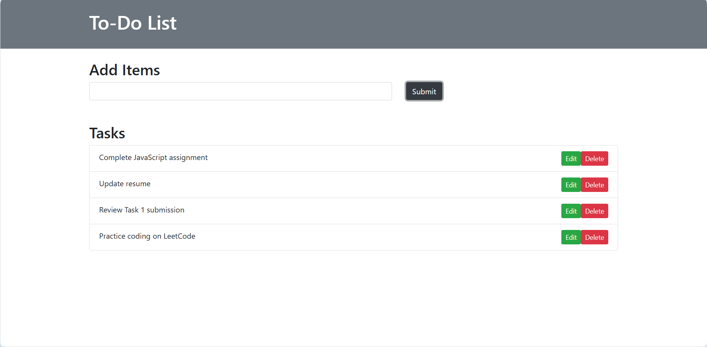

# 📝 Task 2: To-Do List Web App (Front-End Only)

## 📌 Objective
Build a dynamic To-Do List web application using **Vanilla JavaScript**, allowing users to:
- Add tasks
- Mark tasks as complete/incomplete
- Delete tasks

## 🛠️ Tools & Technologies
- **HTML**, **CSS**, **JavaScript**
- **VS Code** (Code Editor)
- **Chrome Browser**
- **live-server** (For live preview)

## 🚀 Features
- Add new tasks dynamically
- Mark tasks as completed (toggle style)
- Remove individual tasks
- Clean, responsive UI
- Instant updates without page reload

## 🧩 Implementation Guide
1. **Setup HTML**
   - Input field for task
   - "Add" button
   - Empty list container

2. **Apply CSS**
   - Neat and clean layout
   - Visual cues for completed tasks (e.g., line-through)

3. **JavaScript Functionality**
   - Add event listeners for the "Add" button
   - Dynamically create and append new tasks
   - Toggle completion status with a click
   - Add a delete button for each task

4. **Testing**
   - Add multiple tasks
   - Complete and un-complete tasks
   - Remove tasks
   - Confirm UI updates in real-time

## 📸 Screenshots

## ✅ Deliverables
- `index.html`
- `styles.css`
- `script.js`

---

Feel free to copy this directly into `Task2/README.md`. Let me know if you'd like to auto-generate the code files too (`index.html`, `styles.css`, `script.js`) as a starter template.

